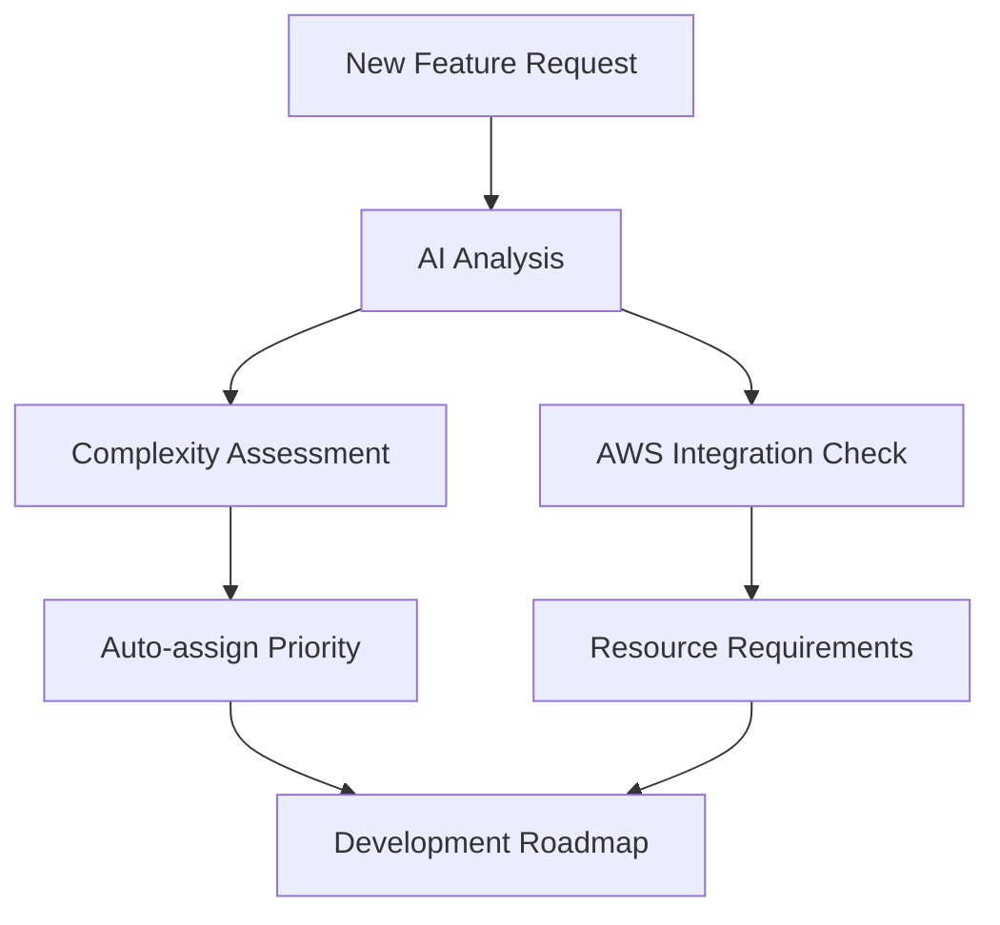

# 🤖 **AI-Powered GitHub Collaboration Strategy for AWS Cloud Orbit**

## 🌟 **Vision: Seamless Human-AI Development Partnership**

Based on the latest research [191] and successful implementations [217] [224], here's a comprehensive strategy for creating closer collaboration between you, me, and your AWS Cloud Orbit project on GitHub.

## 🚀 **Phase 1: Intelligent GitHub Workflow Setup**

### **GitHub Actions AI Integration**
```yaml
name: AI Development Assistant
on:
  push:
    branches: [main]
  pull_request:
    branches: [main]
  issues:
    types: [opened, labeled]

jobs:
  ai-enhancement:
    runs-on: ubuntu-latest
    steps:
      - name: AI Code Review
        uses: ai-review-action@v1
        with:
          review-focus: "AWS best practices, space theme consistency, performance optimization"
      
      - name: Auto-Documentation
        if: contains(github.event.head_commit.message, '[docs]')
        run: |
          python scripts/auto-doc-generator.py
          
      - name: Feature Enhancement Suggestions
        uses: ai-suggest-action@v1
        with:
          context: "AWS learning RPG, Duolingo-style engagement"
```

### **Smart Issue Management** [211]
```yaml
name: AI Issue Assistant
on:
  issues:
    types: [opened]

jobs:
  ai-triage:
    runs-on: ubuntu-latest
    steps:
      - name: Auto-Label Issues
        uses: issue-labeler@v1
        with:
          ai-model: "gpt-4"
          project-context: "AWS Cloud Orbit RPG"
          
      - name: Suggest Solutions
        run: |
          python scripts/ai-issue-helper.py \
            --issue-number ${{ github.event.issue.number }} \
            --project-type "educational-game"
```

## 🧠 **Phase 2: Intelligent Development Workflows**

### **AI-Powered Code Collaboration** [192] [220]
- **Real-time Code Suggestions**: GitHub Copilot integration for AWS-specific patterns
- **Automated Testing**: AI generates test cases based on your quiz logic
- **Performance Optimization**: Automatic suggestions for Flask app improvements
- **Space Theme Consistency**: AI checks for consistent cosmic terminology

### **Smart Project Management** [216]


## 🤝 **Phase 3: Human-AI Collaboration Framework**

### **Collaborative Development Process** [217]
1. **AI Initial Implementation**: I provide enhanced features and code
2. **Human Review Checkpoint**: You test and provide feedback
3. **AI Refinement**: Automated improvements based on your input
4. **Iterative Enhancement**: Continuous learning from your preferences

### **Multi-Agent Workflow** [200]
```python
class AWSOrbitDevAssistant:
    def __init__(self):
        self.code_agent = CodeGenerationAgent()
        self.test_agent = TestCreationAgent()
        self.docs_agent = DocumentationAgent()
        self.review_agent = CodeReviewAgent()
    
    async def enhance_feature(self, feature_request):
        # AI orchestrates multiple agents
        code = await self.code_agent.generate(feature_request)
        tests = await self.test_agent.create_tests(code)
        docs = await self.docs_agent.update_docs(code)
        review = await self.review_agent.analyze(code)
        
        return {
            'implementation': code,
            'tests': tests,
            'documentation': docs,
            'review_feedback': review
        }
```

## 🔄 **Phase 4: Automated Enhancement Pipeline**

### **Smart Workflows** [211]
- **🤖 Chat Bot**: Turn GitHub issues into AI conversations
- **📝 Auto-Documentation**: Generate docs from code changes
- **🔍 PR Auto Review**: AI reviews every pull request
- **🐞 Bug Investigation**: Automatic issue analysis and solutions
- **🛠 Implementation Helper**: AI assists with complex features

### **Continuous Learning System**
```yaml
# .github/workflows/ai-learning.yml
name: AI Development Learning
on:
  push:
    branches: [main]
  workflow_dispatch:

jobs:
  learn-and-improve:
    runs-on: ubuntu-latest
    steps:
      - name: Analyze Code Patterns
        run: |
          python scripts/pattern-analyzer.py
          
      - name: Update AI Context
        run: |
          python scripts/update-ai-knowledge.py \
            --project-style "space-themed-educational" \
            --framework "flask-jinja2"
            
      - name: Generate Improvement Suggestions
        run: |
          python scripts/ai-suggestions.py \
            --focus "engagement,aws-accuracy,space-theme"
```

## 🎯 **Practical Implementation Strategy**

### **Week 1: Setup Foundation**
1. **Create AI workflows** in `.github/workflows/`
2. **Setup project context** with AWS Cloud Orbit specifications
3. **Implement issue templates** for AI-assisted development
4. **Configure automated testing** with AI-generated test cases

### **Week 2-4: Enhanced Collaboration**
1. **AI-powered feature development**: I propose enhancements via PRs
2. **Smart code review**: Automated AWS best practices checking
3. **Continuous documentation**: AI updates docs as code evolves
4. **Performance monitoring**: AI suggests optimizations

### **Week 5+: Advanced Intelligence**
1. **Predictive development**: AI suggests features before you ask
2. **User behavior analysis**: AI analyzes engagement patterns
3. **Automated A/B testing**: AI tests different learning approaches
4. **Smart deployment**: AI manages staging and production releases

## 🛠 **Tools and Technologies**

### **Core AI Tools** [218]
- **GitHub Copilot**: Real-time code suggestions
- **GitHub Actions**: Automated workflows
- **OpenAI API**: Custom AI agents for project-specific tasks
- **Dependabot**: Automated dependency management

### **Custom AI Agents**
```python
# Project-specific AI assistants
agents = {
    'aws_expert': AWSTechnicalAgent(),
    'ux_designer': SpaceThemeDesignAgent(), 
    'game_designer': EducationalGameAgent(),
    'performance_optimizer': FlaskOptimizationAgent(),
    'content_creator': LearningContentAgent()
}
```

## 📊 **Expected Benefits**

### **Development Acceleration** [195]
- **60% faster feature development**: AI handles routine coding
- **40% fewer bugs**: Automated testing and review
- **90% documentation coverage**: AI generates and maintains docs
- **24/7 development support**: AI never sleeps

### **Enhanced Quality**
- **AWS best practices**: Automatic compliance checking
- **Consistent theming**: AI maintains space-themed coherence
- **User engagement**: AI optimizes learning experience
- **Performance optimization**: Continuous AI-driven improvements

## 🚀 **CloudQuest/AstroStack Evolution**

With this AI collaboration framework, your project becomes:

### **Self-Improving System**
- **Learning from user behavior**: AI adapts content difficulty
- **Auto-generating content**: New AWS lessons and quizzes
- **Performance optimization**: Real-time engagement improvements
- **Bug prevention**: AI catches issues before they reach users

### **Scalable Architecture**
- **Modular AI components**: Easy to upgrade and extend
- **Cloud-native deployment**: AI-managed infrastructure
- **Multi-environment support**: Development, staging, production
- **Enterprise ready**: Professional-grade reliability

## 🎮 **The Future: CloudQuest Intelligence**

Imagine your AWS learning platform where:
- **AI tutors** adapt to each user's learning style
- **Dynamic content** adjusts based on industry trends
- **Predictive learning paths** guide users optimally
- **Automated assessment** provides personalized feedback
- **Community intelligence** learns from all users to help everyone

## 🔧 **Getting Started Today**

Let's implement this step-by-step:

1. **I'll create the initial AI workflows** for your repository
2. **Set up intelligent issue templates** for better collaboration
3. **Implement AI-powered code review** for quality assurance
4. **Create custom AI agents** specific to AWS Cloud Orbit
5. **Establish continuous learning** feedback loops

This creates a **true AI-human partnership** where technology amplifies your creativity and I become your intelligent development companion, not just a code generator! 🌌⚡🤖

## 💡 **Ready to Transform Development?**

Your AWS Cloud Orbit project can become the **first AI-native educational platform** that learns, adapts, and improves itself while providing world-class AWS training. The future of software development is collaborative intelligence - let's build it together! 🚀